# Clinovyr Operations Manual

**The definitive guide to running, testing, and delivering the Clinovyr product stack — written for someone with zero prior training.**

| | |
|---|---|
| **Version** | 1.0 — June 2026 |
| **Company** | Clinovyr — Granite Bay / Roseville, California |
| **Tagline** | Intelligence, Applied. |
| **Company inbox** | clinovyr@gmail.com |
| **Hosting** | Cloudflare Workers (Next.js apps) + Railway/Fly.io (AI Agent) |

---

## Table of Contents

1. [Introduction](#1-introduction)
2. [System Overview](#2-system-overview)
3. [Before You Start](#3-before-you-start)
4. [Environment Setup](#4-environment-setup)
5. [Starting the System](#5-starting-the-system)
6. [Product-by-Product Guide](#6-product-by-product-guide)
   - [6.1 AI Readiness Assessment](#61-ai-readiness-assessment)
   - [6.2 AI Agent](#62-ai-agent)
   - [6.3 Client Dashboard](#63-client-dashboard)
   - [6.4 Industry Playbooks Store](#64-industry-playbooks-store)
   - [6.5 Workshop Generator](#65-workshop-generator)
   - [6.6 Automation Templates](#66-automation-templates)
   - [6.7 CRM Automation CLI](#67-crm-automation-cli)
7. [Client Delivery Workflows](#7-client-delivery-workflows)
8. [Running QA & Testing](#8-running-qa--testing)
9. [Cross-System Flows](#9-cross-system-flows)
10. [Troubleshooting](#10-troubleshooting)
11. [Production Deployment](#11-production-deployment)
12. [Security Checklist](#12-security-checklist)
13. [Glossary](#13-glossary)
14. [Quick Reference Cards](#14-quick-reference-cards)

---

## 1. Introduction

### What is Clinovyr?

Clinovyr is an AI consulting firm serving small and mid-size businesses in Placer County, California (Granite Bay, Roseville, and surrounding areas). Clinovyr helps local businesses — medical practices, real estate firms, law firms, construction companies, med spas, and specialty retail — implement AI to save time, reduce costs, and grow.

This repository contains **two layers**:

| Layer | Location | Purpose |
|-------|----------|---------|
| **Marketing website** | Repository root (`/`) | Public site at `clinovyr.com` — services, contact form, brand |
| **Product stack** | `clinovyr-products/` | Deliverable tools you run for clients — assessments, dashboards, agents, playbooks, workshops, automations |

This manual covers the **product stack** and how it connects to client delivery.

### Who is this manual for?

- A new team member with **no Node.js or API experience**
- A contractor preparing to deliver a first client engagement
- Anyone who needs to run QA, start servers, or deploy to production

You do **not** need to understand how to write code. You **do** need to follow numbered steps, copy-paste terminal commands, and know when to ask for help (see troubleshooting sections).

### What you'll learn

By the end of this manual you will know how to:

1. Install prerequisites and configure one shared secrets file
2. Start all four web servers locally and verify they are healthy
3. Run each product individually (assessment, agent, dashboard, playbooks, workshop generator, automation templates)
4. Deliver each Clinovyr service offering to a real client
5. Run the full QA pipeline (Phases 0–6) and integration tests
6. Read GO/NO-GO reports and understand warnings
7. Deploy to Cloudflare and configure production email/payments

---

## 2. System Overview

### All products at a glance

| Product | Folder | Who uses it | Local URL (QA ports) | Production URL |
|---------|--------|-------------|----------------------|----------------|
| AI Readiness Assessment | `assessment/` | Prospects (form) + you (notifications) | http://localhost:3001 | https://assessment.clinovyr.com |
| AI Agent | `ai-agent/` | Client website visitors | http://localhost:3002 | https://agent.clinovyr.com |
| Client Dashboard | `dashboard/` | Paying automation clients + you (admin) | http://localhost:3003 | https://app.clinovyr.com |
| Industry Playbooks | `playbooks/` | Buyers (Stripe checkout) | http://localhost:3004 | https://buy.clinovyr.com |
| Workshop Generator | `workshop-generator/` | You (CLI — no web UI) | N/A (CLI) | N/A |
| Automation Templates | `automation-templates/` | You (CLI + file handoff) | N/A | N/A |
| CRM Automation | `crm-automation/` | You (CLI for HubSpot setup) | N/A | N/A |
| QA Harness | `qa/` | You (testing only) | N/A | N/A |

### Service offerings mapped to products

| Clinovyr service | Primary product(s) |
|------------------|-------------------|
| AI Readiness Assessment ($5,000) | `assessment/` |
| AI Opportunity Audit ($1,500) | `assessment/` (lower-tier result) |
| Workflow Automation Sprint ($12,000) | `automation-templates/`, `dashboard/`, `crm-automation/` |
| AI Operations Retainer | `dashboard/`, `ai-agent/` |
| Workshops | `workshop-generator/` |
| Industry Playbooks ($497) | `playbooks/` |
| AI Strategy / Fractional CAIO | All of the above |

### Architecture diagram

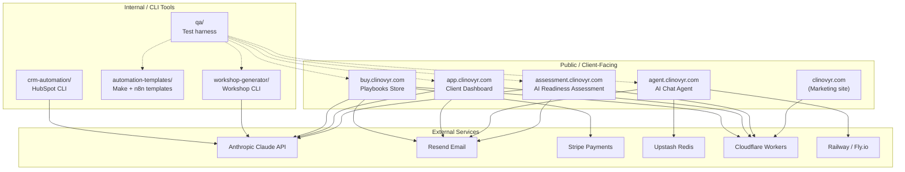

### How data flows (high level)

1. **Prospect fills assessment** → JSON saved locally → Resend emails you at `clinovyr@gmail.com`
2. **Client buys playbook** → Stripe webhook → PDF emailed via Resend
3. **Visitor chats with agent** → Redis session memory → escalation email if frustrated
4. **Client logs into dashboard** → magic link email → reads KPIs from JSON files on disk
5. **You generate workshop** → Claude writes outline → PPTX + speaker guide saved to `output/`
6. **You customize automations** → wizard replaces placeholders → client imports into Make.com or n8n

---

## 3. Before You Start

### Prerequisites

Install these **once** on your Mac:

| Tool | Minimum version | How to check | How to install |
|------|-----------------|--------------|----------------|
| **Node.js** | 22+ (required for Cloudflare deploy) | `node --version` | [nodejs.org](https://nodejs.org) or `brew install node` |
| **npm** | Comes with Node | `npm --version` | Included with Node |
| **Git** | Any recent | `git --version` | `xcode-select --install` or `brew install git` |
| **Terminal** | macOS Terminal or Cursor integrated terminal | — | Already on your Mac |

Optional but recommended for full QA:

| Tool | Purpose |
|------|---------|
| **Stripe CLI** | Test playbook purchases locally |
| **unzip** | Integration tests read PPTX slide text (built into macOS) |
| **Mailpit** | Local email preview for dashboard (if not using Resend) |

### Folder structure

```
Clinoyr/                              ← Repository root (marketing site)
├── .env.local                        ← YOUR SINGLE SECRETS FILE (create this)
├── DEPLOY.md                         ← Marketing site Cloudflare deploy
├── clinovyr-products/
│   ├── CLINOVYR-OPERATIONS-MANUAL.md ← This file
│   ├── DEPLOYMENT.md                 ← Product stack production deploy
│   ├── health-check.ts               ← Ping all 4 health endpoints
│   ├── assessment/                   ← AI Readiness Assessment app
│   ├── ai-agent/                     ← Express chat agent
│   ├── dashboard/                    ← Client dashboard
│   ├── playbooks/                    ← Playbook store + generator
│   ├── workshop-generator/           ← Workshop CLI
│   ├── automation-templates/         ← Make.com + n8n blueprints
│   ├── crm-automation/               ← HubSpot setup CLI
│   ├── qa/                           ← Full test harness
│   └── shared/                       ← Shared utilities
```

### The golden rule: one `.env.local` at repo root

**All API keys live in one file:**

```
/Users/tullystroud/Desktop/Clinoyr/.env.local
```

Do **not** maintain separate secret files per product. The QA harness loads **only** the root file.

Next.js apps normally read `.env.local` from their own folder. For local development, **symlink** the root file into each app:

```bash
# Run from each Next.js product folder:
ln -sf ../../.env.local .env.local
```

The AI Agent and CLI tools also fall back to the repo root automatically, but symlinks keep everything consistent.

> **If something goes wrong:** If a product says "API key missing" but you know you set it, check whether that product folder has a stale `.env.local` that overrides the root file. Delete the stale copy and recreate the symlink.

---

## 4. Environment Setup

### Step-by-step first-time setup

Follow these steps exactly the first time you set up your machine.

#### Step 1: Clone and enter the repo

```bash
cd ~/Desktop/Clinoyr
```

#### Step 2: Create your secrets file

Create `/Users/tullystroud/Desktop/Clinoyr/.env.local` with this template. Fill in real values where indicated — **never commit this file to Git**.

```bash
cat > .env.local << 'EOF'
# ═══════════════════════════════════════════════════════════
# CLINOVYR — Single local secrets file
# Location: /Clinoyr/.env.local
# ═══════════════════════════════════════════════════════════

# ── Anthropic (Claude AI) ──────────────────────────────────
# Get from: https://console.anthropic.com/
# Must start with sk-ant-
ANTHROPIC_API_KEY=

# ── Resend (Email) ─────────────────────────────────────────
# Get from: https://resend.com/api-keys
# Must start with re_
RESEND_API_KEY=

# Company inbox — internal notifications go HERE
CONTACT_EMAIL=clinovyr@gmail.com

# Sandbox mode until clinovyr.com is verified in Resend
RESEND_SANDBOX=true
RESEND_FROM_EMAIL=Clinovyr <onboarding@resend.dev>

# QA test recipient (defaults to CONTACT_EMAIL)
QA_TEST_EMAIL=clinovyr@gmail.com

# ── Dashboard (Auth) ───────────────────────────────────────
# Generate secrets with: openssl rand -base64 32
AUTH_SECRET=
NEXTAUTH_SECRET=
CRON_SECRET=

ADMIN_EMAIL=clinovyr@gmail.com
NEXTAUTH_URL=http://localhost:3003
ENABLE_TEST_AUTH=true

EMAIL_FROM=Clinovyr <onboarding@resend.dev>

# ── Stripe (Playbooks — test mode) ─────────────────────────
# Get from: https://dashboard.stripe.com/test/apikeys
STRIPE_SECRET_KEY=
STRIPE_WEBHOOK_SECRET=
NEXT_PUBLIC_STRIPE_PUBLISHABLE_KEY=

# ── AI Agent ───────────────────────────────────────────────
PORT=3002
UPSTASH_REDIS_REST_URL=
UPSTASH_REDIS_REST_TOKEN=

# ── Site URLs (local QA ports) ─────────────────────────────
SITE_URL=http://localhost:3001
NEXT_PUBLIC_SITE_URL=http://localhost:3001
EOF
```

#### Step 3: Generate random secrets

Run this three times and paste each result into `AUTH_SECRET`, `NEXTAUTH_SECRET`, and `CRON_SECRET`:

```bash
openssl rand -base64 32
```

#### Step 4: Install dependencies for every product

```bash
cd ~/Desktop/Clinoyr/clinovyr-products/assessment && npm install
cd ~/Desktop/Clinoyr/clinovyr-products/ai-agent && npm install
cd ~/Desktop/Clinoyr/clinovyr-products/dashboard && npm install
cd ~/Desktop/Clinoyr/clinovyr-products/playbooks && npm install
cd ~/Desktop/Clinoyr/clinovyr-products/workshop-generator && npm install
cd ~/Desktop/Clinoyr/clinovyr-products/automation-templates && npm install
cd ~/Desktop/Clinoyr/clinovyr-products/crm-automation && npm install
cd ~/Desktop/Clinoyr/clinovyr-products/qa && npm install
```

#### Step 5: Create symlinks in Next.js apps

```bash
cd ~/Desktop/Clinoyr/clinovyr-products/assessment && ln -sf ../../.env.local .env.local
cd ~/Desktop/Clinoyr/clinovyr-products/dashboard && ln -sf ../../.env.local .env.local
cd ~/Desktop/Clinoyr/clinovyr-products/playbooks && ln -sf ../../.env.local .env.local
```

#### Step 6: Verify your Anthropic key works

```bash
cd ~/Desktop/Clinoyr/clinovyr-products/qa
npx ts-node phases/phase0-env-check.ts
```

You should see green checkmarks for ENV-01 (Anthropic) and ENV-02 (Resend).

**What success looks like:** Phase 0 prints `✓ [ENV-01] Anthropic API Key Live Test` with a model response like "OK". Resend shows `✓ [ENV-02]`.

> **If something goes wrong:** If ENV-01 fails with "wrong format", your key must start with `sk-ant-`. If it fails with a network error, check your internet connection and that the key is active in the Anthropic console.

### Every environment variable explained

| Variable | Required? | Plain English |
|----------|-----------|---------------|
| `ANTHROPIC_API_KEY` | Yes (for AI features) | Password that lets Clinovyr apps talk to Claude AI. Used for assessment reports, workshop outlines, playbook generation, and monthly dashboard reports. |
| `RESEND_API_KEY` | Yes (for email) | Password that lets apps send email through Resend. |
| `CONTACT_EMAIL` | Yes | **Your** company inbox (`clinovyr@gmail.com`). Assessment submissions and contact notifications arrive here. |
| `RESEND_SANDBOX` | Yes (local) | When `true`, emails only deliver to the Resend account owner's Gmail. Safe for testing. |
| `RESEND_FROM_EMAIL` | Local | Sender address. Use `Clinovyr <onboarding@resend.dev>` until your domain is verified. |
| `QA_TEST_EMAIL` | Optional | Email used in QA test submissions. Defaults to `CONTACT_EMAIL`. |
| `AUTH_SECRET` | Yes (dashboard) | Random string that encrypts login sessions. Generate with `openssl rand -base64 32`. |
| `NEXTAUTH_SECRET` | Yes (dashboard) | Same as above — set both to the same value locally. |
| `CRON_SECRET` | Yes (dashboard) | Password that protects the monthly report cron endpoint. |
| `ADMIN_EMAIL` | Yes (dashboard) | Email address that gets admin access to `/admin`. Use `clinovyr@gmail.com` locally. |
| `NEXTAUTH_URL` | Yes (dashboard) | Full URL of the dashboard app. Local: `http://localhost:3003`. Production: `https://app.clinovyr.com`. |
| `ENABLE_TEST_AUTH` | Local only | When `true`, allows QA to bypass magic-link login. **Never set in production.** |
| `EMAIL_FROM` | Dashboard | Sender for dashboard magic links and reports. |
| `STRIPE_SECRET_KEY` | Playbooks | Stripe test/live secret key (`sk_test_...` or `sk_live_...`). |
| `STRIPE_WEBHOOK_SECRET` | Playbooks | Signing secret from Stripe webhook setup (`whsec_...`). |
| `NEXT_PUBLIC_STRIPE_PUBLISHABLE_KEY` | Playbooks | Public Stripe key shown in the browser (`pk_test_...`). |
| `PORT` | AI Agent | Which port the agent server listens on. Use `3002` for QA, `3100` for health-check defaults. |
| `UPSTASH_REDIS_REST_URL` | Recommended | Cloud Redis URL for agent session memory (production). |
| `UPSTASH_REDIS_REST_TOKEN` | Recommended | Token paired with Upstash URL. |
| `SITE_URL` | Optional | Canonical URL embedded in emails and links. |

### Resend sandbox rules (critical)

Until `clinovyr.com` is verified in Resend:

| Setting | Value |
|---------|-------|
| `CONTACT_EMAIL` | `clinovyr@gmail.com` |
| `RESEND_FROM_EMAIL` | `Clinovyr <onboarding@resend.dev>` |
| `RESEND_SANDBOX` | `true` |

In sandbox mode:
- Resend **only delivers to the account owner's Gmail** (the email you used to sign up for Resend)
- All QA test emails must use `clinovyr@gmail.com`
- Assessment submit still succeeds if email fails — check `emailSent` in the API response
- Escalation emails to client addresses (e.g. `staff@demo-practice.com`) will **not** arrive — this is expected

---

## 5. Starting the System

### Understanding ports (read this carefully)

There are **two port conventions** in this codebase. Both are valid — pick one and stay consistent.

#### QA / Integration test ports (recommended for full-stack testing)

| Service | Port | Start command |
|---------|------|---------------|
| Assessment | **3001** | `next dev -p 3001` |
| AI Agent | **3002** | `PORT=3002 npm run dev` |
| Dashboard | **3003** | `next dev -p 3003` |
| Playbooks | **3004** | `next dev -p 3004` |

These match `integration-test.ts` and the QA phase scripts when you pass URL environment variables.

#### health-check.ts default ports

| Service | Port |
|---------|------|
| Assessment | 3001 |
| AI Agent | **3100** |
| Dashboard | **3002** |
| Playbooks | **3003** |

Run health check against QA ports:

```bash
# Custom — not built into health-check.ts; use curl or integration test preflight instead
curl http://localhost:3001/api/health
curl http://localhost:3002/api/health
curl http://localhost:3003/api/health
curl http://localhost:3004/api/health
```

Or use the built-in script (expects health-check defaults — agent on 3100, dashboard on 3002, playbooks on 3003):

```bash
cd ~/Desktop/Clinoyr/clinovyr-products
npx tsx health-check.ts --local
```

> **Tip:** For day-to-day QA work, use the **3001/3002/3003/3004** scheme and pass URLs to the test scripts explicitly.

### Start all four servers (QA ports)

Open **four separate terminal tabs** (or use a terminal multiplexer):

**Terminal 1 — Assessment:**
```bash
cd ~/Desktop/Clinoyr/clinovyr-products/assessment
npm run dev -- -p 3001
```

**Terminal 2 — AI Agent:**
```bash
cd ~/Desktop/Clinoyr/clinovyr-products/ai-agent
PORT=3002 npm run dev
```

**Terminal 3 — Dashboard:**
```bash
cd ~/Desktop/Clinoyr/clinovyr-products/dashboard
npm run dev -- -p 3003
```

**Terminal 4 — Playbooks:**
```bash
cd ~/Desktop/Clinoyr/clinovyr-products/playbooks
npm run dev -- -p 3004
```

**What success looks like:** Each terminal shows "Ready" or "listening on http://localhost:XXXX". No red error stack traces about missing modules.

### Verify health

```bash
curl -s http://localhost:3001/api/health | python3 -m json.tool
curl -s http://localhost:3002/api/health | python3 -m json.tool
curl -s http://localhost:3003/api/health | python3 -m json.tool
curl -s http://localhost:3004/api/health | python3 -m json.tool
```

Healthy response looks like:

```json
{
  "status": "ok",
  "checks": {
    "filesystem": true,
    "env": { "ANTHROPIC_API_KEY": true, "RESEND_API_KEY": true },
    "anthropicKeyFormat": true
  }
}
```

| HTTP status | `status` field | Meaning |
|-------------|----------------|---------|
| 200 | `ok` | Everything working |
| 200 | `degraded` | Running but optional config missing (e.g. Stripe keys) |
| 503 | `error` | Critical failure — missing required env or unwritable data directory |

> **If something goes wrong — port conflicts:** If you see `EADDRINUSE: address already in use`, another process is using that port. Find and kill it:
> ```bash
> lsof -i :3001   # replace 3001 with the conflicting port
> kill -9 <PID>   # replace PID with the number from lsof output
> ```

---

## 6. Product-by-Product Guide

---

### 6.1 AI Readiness Assessment

#### What it does (plain language)

A multi-step web form that prospects fill out. It scores their business on AI readiness (0–100), assigns a tier (Foundation / Developing / Advanced / Leader), recommends a Clinovyr service package, saves the submission, and emails you a notification.

#### Who uses it

| User | Action |
|------|--------|
| **Prospect (client)** | Fills out the form at `assessment.clinovyr.com` |
| **You (Clinovyr)** | Receives notification email at `clinovyr@gmail.com`, reviews saved JSON, optionally generates PDF report |

#### How to run locally

```bash
cd ~/Desktop/Clinoyr/clinovyr-products/assessment
ln -sf ../../.env.local .env.local   # if not already done
npm install
npm run dev -- -p 3001
```

Open http://localhost:3001 in your browser.

#### Key URLs and endpoints

| URL / Endpoint | Method | Purpose |
|----------------|--------|---------|
| `/` | GET | Assessment form (multi-step UI) |
| `/api/health` | GET | Health check |
| `/api/submit-assessment` | POST | Submit completed form |
| `/api/generate-report` | POST | Generate PDF report for an assessment ID |

#### Where files are saved

| Path | Contents |
|------|----------|
| `assessment/data/assessments/{id}.json` | Full submission + score |
| `assessment/data/reports/{id}.pdf` | Generated PDF reports |
| `assessment/data/reports/archive/` | Legacy/small PDFs moved here during QA cleanup |

Assessment IDs look like: `1780430788850-qa-test-dental-low`

#### Scoring tiers and packages

| Tier | Typical score range | Recommended package |
|------|---------------------|---------------------|
| Foundation | Low | AI Opportunity Audit ($1,500) |
| Developing | Mid | AI Readiness Assessment ($5,000) |
| Advanced | High-mid | Workflow Automation Sprint ($12,000) |
| Leader | High | Workflow Automation Sprint ($12,000) |

#### User journey flowchart

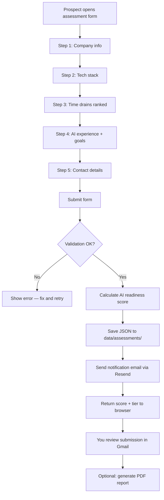

**What success looks like:** After submitting the form, the browser shows a success message with score and tier. You receive an email at `clinovyr@gmail.com` with subject containing "AI Readiness Assessment" and the company name. A JSON file appears in `data/assessments/`.

> **If something goes wrong:** If submit succeeds but no email arrives, check the API response for `emailSent: false` and `emailWarning`. In sandbox mode, the prospect's email address doesn't matter — only `clinovyr@gmail.com` receives mail.

---

### 6.2 AI Agent

#### What it does (plain language)

A chat widget you embed on a client's website. Visitors ask questions; the agent answers from the client's FAQ config. If the visitor is frustrated or asks for a human, the agent escalates — sending an email to the client's escalation address.

#### Who uses it

| User | Action |
|------|--------|
| **Client's website visitors** | Chat via embedded widget |
| **You (Clinovyr)** | Configure client JSON, deploy agent, monitor escalations |

#### How to run locally

```bash
cd ~/Desktop/Clinoyr/clinovyr-products/ai-agent
npm install
PORT=3002 npm run dev
```

Server listens at http://localhost:3002

#### Key URLs and endpoints

| URL / Endpoint | Method | Purpose |
|----------------|--------|---------|
| `/api/health` | GET | Health check |
| `/api/agent` | POST | Send chat message |
| `/api/process-escalation-queue` | POST | Process queued escalation emails |
| `/widget.js` | GET | Embeddable chat widget script |

#### Client configuration files

Each client has a JSON file at:

```
ai-agent/config/clients/{clientId}.json
```

Example clients:

| File | Business | Notes |
|------|----------|-------|
| `demo-practice.json` | Granite Bay Family Medicine | Default demo |
| `granite-bay-dental.json` | Granite Bay Dental | Production-ready fake client |

Example config structure:

```json
{
  "clientId": "granite-bay-dental",
  "businessName": "Granite Bay Dental",
  "hours": "Monday–Friday 8:00 AM – 5:00 PM",
  "bookingLink": "https://granitebaydental.com/book",
  "escalationEmail": "clinovyr@gmail.com",
  "escalationFrom": "Clinovyr Agent <onboarding@resend.dev>",
  "faqs": [
    {
      "keywords": ["insurance", "dental insurance"],
      "answer": "We accept most major PPO dental plans..."
    }
  ]
}
```

#### Where data is saved

| Path | Contents |
|------|----------|
| `ai-agent/data/escalation-queue.json` | Pending escalation emails |
| Redis / Upstash | Session conversation memory |

#### User journey flowchart

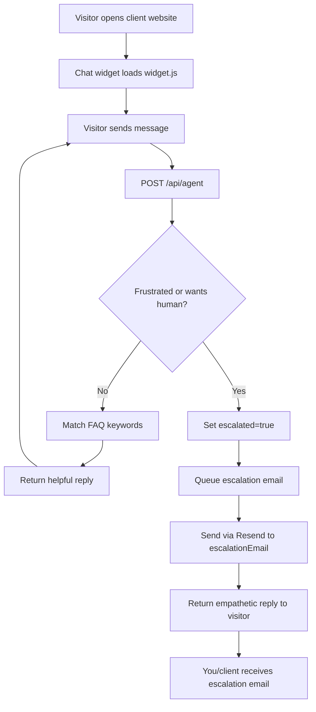

**What success looks like:** POST to `/api/agent` with a frustrated message returns `"escalated": true`. In sandbox mode, escalation email arrives at `clinovyr@gmail.com` (if `escalationEmail` is set to that address).

> **If something goes wrong:** If agent returns 404 for unknown `clientId`, verify the JSON file exists in `config/clients/`. If sessions don't persist across restarts, set up Upstash Redis for production.

---

### 6.3 Client Dashboard

#### What it does (plain language)

A passwordless web app where automation clients sign in via email magic link and view their KPIs, automations, monthly PDF reports, and settings. You (admin) can see all clients at `/admin`.

#### Who uses it

| User | Action |
|------|--------|
| **Paying client** | Signs in, views dashboard, downloads reports |
| **You (admin)** | Manages clients at `/admin`, generates reports, configures cron |

#### How to run locally

```bash
cd ~/Desktop/Clinoyr/clinovyr-products/dashboard
ln -sf ../../.env.local .env.local
npm install
npm run dev -- -p 3003
```

Open http://localhost:3003

#### Demo / test credentials

| Role | Email | How to sign in locally |
|------|-------|------------------------|
| Client | `demo@demopractice.com` | Magic link (check Mailpit or Resend) |
| Admin | Value of `ADMIN_EMAIL` in `.env.local` | Magic link or `ENABLE_TEST_AUTH=true` for QA |

#### Key URLs and pages

| Route | Purpose |
|-------|---------|
| `/login` | Magic link sign-in |
| `/dashboard` | Client overview — KPIs, chart, automations |
| `/dashboard/automations` | Automation table with run logs |
| `/dashboard/reports` | Monthly PDF reports |
| `/dashboard/settings` | Notifications, escalation, hours, FAQ |
| `/admin` | All clients, MRR summary (admin only) |

#### API routes

| Method | Route | Purpose |
|--------|-------|---------|
| GET | `/api/health` | Health check |
| GET | `/api/dashboard/kpis` | KPI data for logged-in client |
| GET | `/api/dashboard/automations` | Automation list |
| GET | `/api/dashboard/reports` | Report metadata |
| POST | `/api/dashboard/report/generate` | Generate monthly PDF |
| GET/PUT | `/api/dashboard/settings` | Read/update settings |
| GET/POST | `/api/admin` | Admin client list + actions |
| GET | `/api/cron/monthly-reports` | Cron trigger (requires Bearer token) |

#### Where files are saved

Each client gets a folder:

```
dashboard/data/clients/{clientId}/
├── config.json          # Profile, email, plan, hours, FAQ
├── automations.json     # Automation list + recent runs
├── kpis.json            # Dashboard KPIs + chart data
├── activity.json        # Activity feed
├── reports.json         # Report metadata
├── runs/                # Individual run log JSON files
│   └── qa-run-1.json
└── reports/             # Generated PDF files
    └── 2026-05.pdf
```

Known test clients:

| Client ID | Name | Purpose |
|-----------|------|---------|
| `demo-practice` | Demo Practice | Default demo |
| `granite-bay-dental` | Granite Bay Dental | Seeded test data |
| `qa-granite-bay-dental` | QA Granite Bay Dental | QA harness fixture (500 tasks, 50 runs) |
| `roseville-realty` | Roseville Realty Group | Seeded test data |
| `sierra-construction` | Sierra Construction | Seeded test data |

#### User journey flowchart

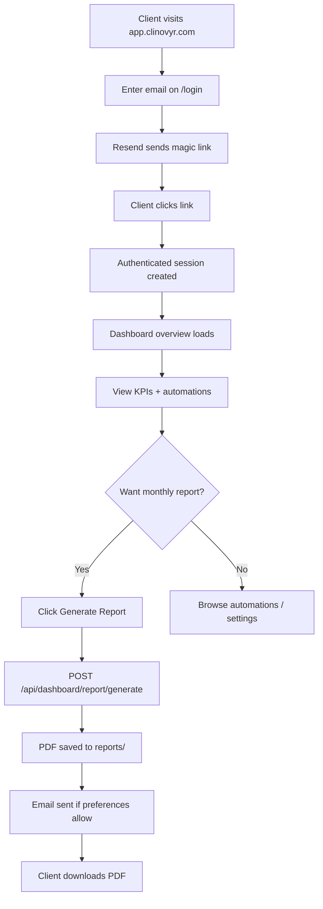

**What success looks like:** Client can sign in, sees KPI numbers matching `kpis.json`, and generated PDF is ≥10KB in `reports/`.

> **If something goes wrong:** If magic link doesn't arrive, confirm `RESEND_API_KEY` is set and `RESEND_SANDBOX=true` with `ADMIN_EMAIL=clinovyr@gmail.com`. For QA without email, set `ENABLE_TEST_AUTH=true`.

---

### 6.4 Industry Playbooks Store

#### What it does (plain language)

An e-commerce site where businesses buy industry-specific AI implementation playbooks for $497. Customer pays via Stripe, receives PDF by email.

Five industries: Medical, Real Estate, Legal, Construction, Wellness.

#### Who uses it

| User | Action |
|------|--------|
| **Buyer (client)** | Browses `/playbooks/medical`, purchases, downloads PDF |
| **You (Clinovyr)** | Generate playbook content, build PDFs, manage Stripe |

#### How to run locally

```bash
cd ~/Desktop/Clinoyr/clinovyr-products/playbooks
ln -sf ../../.env.local .env.local
npm install
npm run dev -- -p 3004
```

Open http://localhost:3004/playbooks/medical

#### Key URLs and endpoints

| URL / Endpoint | Purpose |
|----------------|---------|
| `/playbooks/medical` | Medical playbook sales page |
| `/playbooks/real-estate` | Real Estate sales page |
| `/playbooks/legal` | Legal sales page |
| `/playbooks/construction` | Construction sales page |
| `/playbooks/wellness` | Wellness sales page |
| `/api/health` | Health check |
| `/api/playbook-checkout` | POST — creates Stripe Checkout session |
| `/api/playbook-webhook` | POST — Stripe webhook (payment complete) |
| `/api/playbook-download` | GET — download PDF after purchase |

#### CLI commands (content generation)

```bash
cd ~/Desktop/Clinoyr/clinovyr-products/playbooks

# Generate playbook JSON (calls Claude ~11 times per industry)
npm run generate -- --industry "Medical" --version 1

# Generate all 5 industries
npm run generate:all -- --version 1

# Build PDF from JSON
npm run build-pdf -- --industry medical --version 1
npm run build-pdf:all -- --version 1

# Validate content quality
npm run validate:content
npm run verify:pdfs
```

#### Where files are saved

| Path | Contents |
|------|----------|
| `playbooks/content/playbooks/{slug}/v1.json` | Generated playbook JSON (~120KB) |
| `playbooks/output/pdfs/{slug}-v1.pdf` | Built PDF (~170KB) |
| `playbooks/public/previews/{slug}/` | Sales page preview images |
| `playbooks/data/processed-payments.json` | Webhook idempotency log |

#### Purchase flow flowchart

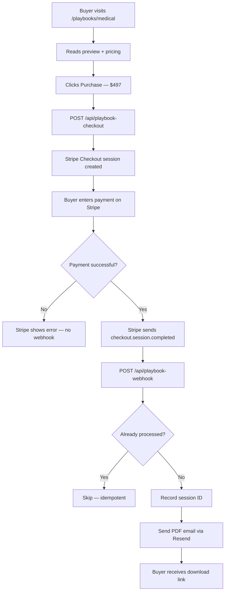

**What success looks like:** Checkout redirects to Stripe test page. After payment, PDF email arrives at buyer's address (in sandbox: only `clinovyr@gmail.com`).

> **If something goes wrong:** Without `STRIPE_SECRET_KEY`, health returns `503` and checkout fails — this is a WARN in QA, not a FAIL. For local webhook testing, run `stripe listen --forward-to localhost:3004/api/playbook-webhook`.

---

### 6.5 Workshop Generator

#### What it does (plain language)

A command-line tool that creates a customized AI workshop PowerPoint deck and facilitator guide for a specific client. Claude writes the outline; the tool builds branded files.

#### Who uses it

| User | Action |
|------|--------|
| **You (Clinovyr)** | Run CLI before delivering a workshop |
| **Workshop attendees (client)** | Receive the PPTX — they don't run anything |

#### How to run

```bash
cd ~/Desktop/Clinoyr/clinovyr-products/workshop-generator
npm install

npm run generate -- \
  --industry "Medical" \
  --company "Granite Bay Dental" \
  --audience "office managers and dentists" \
  --duration 90
```

| Flag | Required | Default | Description |
|------|----------|---------|-------------|
| `--industry` | Yes | — | e.g. Medical, Legal, Construction |
| `--company` | Yes | — | Client company name (appears in slides) |
| `--audience` | Yes | — | Who is in the room |
| `--duration` | No | 90 | Total minutes |

#### Where files are saved

```
workshop-generator/output/
├── granite-bay-dental-2026-06-02-workshop.pptx      (~200–265KB)
└── granite-bay-dental-2026-06-02-workshop-guide.md  (~20–26KB)
```

Filenames use `{company-slug}-{date}-workshop.pptx`.

#### Workshop generation flowchart

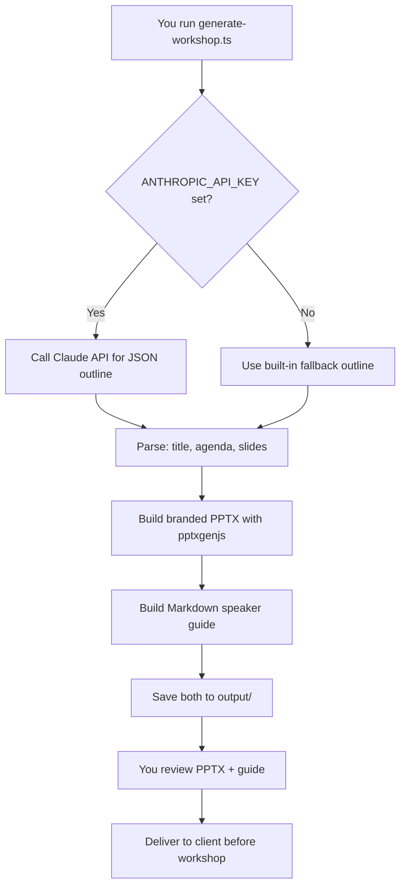

**What success looks like:** Two files in `output/`, PPTX opens in PowerPoint/Keynote, guide has `### Slide N:` sections with speaker notes. Slide 2 should mention local area (Granite Bay, Roseville, or Placer County).

> **If something goes wrong:** If you see "dry-run fallback" in logs, your API key isn't loading. Confirm `../../.env.local` exists or symlink `.env.local` in this folder.

---

### 6.6 Automation Templates

#### What it does (plain language)

A library of pre-built automation blueprints for **Make.com** and **n8n** that you customize and hand off to clients. Covers lead follow-up, appointment reminders, review requests, invoicing, monthly reports, social publishing, and chatbot escalation.

#### Who uses it

| User | Action |
|------|--------|
| **You (Clinovyr)** | Customize templates via wizard, deliver to client |
| **Client's ops team** | Import blueprints into Make.com or n8n, connect accounts |

#### Make.com templates

```bash
cd ~/Desktop/Clinoyr/clinovyr-products/automation-templates/make
npm install
npm run wizard
```

The wizard prompts for client details and writes customized files to:

```
automation-templates/make/customized-for-client/{company-slug}/
├── lead-followup-email.blueprint.json
├── substitutions-audit.json
└── README.md
```

**8 templates:**

1. lead-followup-email
2. appointment-reminder-sms
3. review-request
4. new-client-onboarding
5. invoice-followup
6. monthly-report
7. social-content-publish
8. ai-chatbot-escalation

#### n8n templates

Located at `automation-templates/n8n/` — import `.workflow.json` files directly into n8n:

1. medical-appointment-reminder
2. real-estate-lead-qualifier
3. review-generation
4. social-content-pipeline
5. invoice-followup
6. monthly-client-report

Each has a setup guide in `automation-templates/n8n/guides/`.

#### Customization placeholders

| Placeholder | Replaced with |
|-------------|---------------|
| `{{COMPANY_NAME}}` | Client company name |
| `{{CRM_TYPE}}` | HubSpot, Salesforce, etc. |
| `{{EMAIL_PROVIDER}}` | Gmail, SendGrid, etc. |
| `{{WEBHOOK_URL}}` | Client webhook endpoint |
| `{{CLIENT_*}}` | n8n-specific client values |

**What success looks like:** Wizard completes without errors. Customized folder contains JSON blueprints with no remaining `{{PLACEHOLDER}}` tokens (except intentional n8n credential IDs the client fills in).

> **If something goes wrong:** The wizard is interactive-only (no `--dry-run` flag). QA runs programmatic customization instead. For manual use, answer each prompt carefully — you can re-run for a different client.

---

### 6.7 CRM Automation CLI

#### What it does (plain language)

Automates HubSpot CRM setup for new clients: audits existing CRM, creates AI custom properties, generates lead scoring rules, builds email nurture sequences, and produces a setup report.

#### Who uses it

| User | Action |
|------|--------|
| **You (Clinovyr)** | Run CLI during client onboarding |
| **Client** | Receives setup report + manual workflow instructions |

#### How to run

```bash
cd ~/Desktop/Clinoyr/clinovyr-products/crm-automation
npm install
cp configs/client.example.json configs/client.json
# Edit configs/client.json with client's HubSpot API key

# Preview without writing to HubSpot:
npx ts-node setup-crm.ts --client configs/client.json --dry-run

# Live setup:
npx ts-node setup-crm.ts --client configs/client.json
```

#### Output files

```
crm-automation/output/
├── crm-audit-{clientId}.json
├── email-sequence-{clientId}.json
├── workflow-stub-lead-scoring-{clientId}.json
├── dashboard-setup-{clientId}.json
└── setup-complete-{clientId}.md
```

**What success looks like:** `setup-complete-{clientId}.md` report generated. In dry-run mode, no HubSpot changes made.

---

## 7. Client Delivery Workflows

These are step-by-step procedures for delivering each Clinovyr service. Follow them in order.

---

### 7.1 AI Readiness Assessment delivery

**Service:** AI Readiness Assessment ($5,000) or AI Opportunity Audit ($1,500)

| Step | Action | Tool |
|------|--------|------|
| 1 | Send prospect the link: `https://assessment.clinovyr.com` | — |
| 2 | Prospect completes form | `assessment/` |
| 3 | Verify notification email arrived at `clinovyr@gmail.com` | Gmail |
| 4 | Open saved JSON in `assessment/data/assessments/` | Finder |
| 5 | Review score, tier, and recommended package | — |
| 6 | Generate PDF report if needed | POST `/api/generate-report` or QA phase 1 |
| 7 | Schedule follow-up call to walk through results | Calendar |
| 8 | Propose next engagement based on tier | — |

**Fake client test data (from QA):**

| Fixture | Company | Expected tier | Package |
|---------|---------|-----------------|---------|
| Low | QA Test Dental — Low | Foundation | AI Opportunity Audit ($1,500) |
| Mid | QA Test Realty — Mid | Developing | AI Readiness Assessment ($5,000) |
| High | QA Test Law — High | Advanced/Leader | Workflow Automation Sprint ($12,000) |

**What success looks like:** PDF ≥15KB, notification email received, JSON file on disk with valid score 0–100.

---

### 7.2 Workshop delivery

**Service:** Custom AI Workshop (half-day or full-day)

| Step | Action | Command |
|------|--------|---------|
| 1 | Gather client details: industry, company name, audience, duration | — |
| 2 | Generate workshop deck | `npm run generate -- --industry "Medical" --company "Granite Bay Dental" --audience "..." --duration 90` |
| 3 | Open PPTX — verify slide 2 mentions local area | PowerPoint/Keynote |
| 4 | Open speaker guide — verify notes for every slide | VS Code / Cursor |
| 5 | Customize examples if needed (manual edits) | PowerPoint |
| 6 | Send PPTX + guide to client 48 hours before workshop | Email |
| 7 | Deliver workshop using guide | In person / Zoom |
| 8 | Follow up with automation recommendations | — |

**QA-generated workshops (ready-made examples):**

| Company | Industry | PPTX size |
|---------|----------|-----------|
| Placer Valley Medical Group | Medical | ~246KB |
| Sierra Foothills Realty | Real Estate | ~265KB |
| Roseville Business Law Group | Legal | ~201KB |
| Granite Bay Builders | Construction | ~230KB |
| Rocklin Med Spa & Wellness | Wellness | ~210KB |
| Fountains Retail Partners | Retail | ~251KB |

---

### 7.3 Industry Playbook sale

**Service:** Industry AI Playbook ($497)

| Step | Action |
|------|--------|
| 1 | Ensure playbook JSON + PDF exist for the industry | `npm run generate:all -- --version 1` then `npm run build-pdf:all` |
| 2 | Verify PDF ≥50KB and content ≥8,000 words | `npm run validate:content && npm run verify:pdfs` |
| 3 | Confirm Stripe is configured (test or live keys) | `.env.local` |
| 4 | Send buyer the link: `https://buy.clinovyr.com/playbooks/medical` | — |
| 5 | Buyer completes Stripe checkout | — |
| 6 | Webhook fires → PDF emailed automatically | — |
| 7 | Confirm buyer received email with download link | — |

**Stripe test card:** `4242 4242 4242 4242`, any future expiry, any CVC.

---

### 7.4 AI Agent deployment

**Service:** AI Operations Retainer (includes website chat agent)

| Step | Action |
|------|--------|
| 1 | Create client config: `ai-agent/config/clients/{clientId}.json` | Copy from `demo-practice.json` or `granite-bay-dental.json` |
| 2 | Customize: businessName, hours, bookingLink, escalationEmail, FAQs | — |
| 3 | Test locally: `PORT=3002 npm run dev`, POST to `/api/agent` | — |
| 4 | Test escalation with frustrated message | — |
| 5 | Deploy to Railway or Fly.io | See [Section 11](#11-production-deployment) |
| 6 | Set up Upstash Redis for production session memory | — |
| 7 | Give client the embed snippet: `<script src="https://agent.clinovyr.com/widget.js" data-client-id="{clientId}"></script>` | — |
| 8 | Verify widget on client's staging site | Browser |
| 9 | Monitor escalations at client's `escalationEmail` | — |

**Reference config:** `granite-bay-dental.json` — Placer County dental practice with Roseville address, insurance FAQs, and escalation to `clinovyr@gmail.com`.

---

### 7.5 Dashboard onboarding

**Service:** AI Operations Retainer / Automation Sprint (ongoing)

| Step | Action |
|------|--------|
| 1 | Create client folder: `dashboard/data/clients/{clientId}/` | — |
| 2 | Add `config.json` with client email (must match sign-in address) | — |
| 3 | Add `automations.json`, `kpis.json`, `activity.json`, `reports.json` | Copy from demo or run seed script |
| 4 | Create `reports/` and `runs/` directories | — |
| 5 | Set client's plan and MRR in config | — |
| 6 | Deploy dashboard to Cloudflare | See [Section 11](#11-production-deployment) |
| 7 | Send client the login link: `https://app.clinovyr.com/login` | — |
| 8 | Client enters email → receives magic link | — |
| 9 | Configure monthly report cron (1st of month, 9 AM PT) | Cloudflare cron or external |
| 10 | Verify first monthly report generates and emails correctly | — |

**Seed script for realistic test data:**

```bash
cd ~/Desktop/Clinoyr/clinovyr-products/dashboard
npx ts-node scripts/seed-test-data.ts
```

Creates: `granite-bay-dental`, `roseville-realty`, `sierra-construction` with months of run history.

---

### 7.6 Automation template handoff

**Service:** Workflow Automation Sprint ($12,000)

| Step | Action |
|------|--------|
| 1 | Identify which automations the client needs (from assessment) | — |
| 2 | Run Make.com wizard: `npm run wizard` in `automation-templates/make/` | — |
| 3 | Enter client company name, CRM type, email provider, webhook URL | — |
| 4 | Review customized blueprints in `customized-for-client/{slug}/` | — |
| 5 | Select matching n8n workflows if client uses n8n instead | `automation-templates/n8n/` |
| 6 | Deliver package: blueprints + setup guides + README | Email / shared drive |
| 7 | Walk client through Make.com import (see make/README.md) | Call |
| 8 | Client reconnects modules to their live accounts | Client |
| 9 | Test each automation with staging data | — |
| 10 | Enable automations in production | Client |
| 11 | Add automations to client's dashboard data | `dashboard/data/clients/{id}/automations.json` |

---

### 7.7 Fake-client deliverable review checklist

Use this checklist when reviewing all deliverables "as a fake client" before go-live (from prior QA work):

| # | Deliverable | Pass criteria | Location |
|---|-------------|---------------|----------|
| 1 | Assessment PDF (Low tier) | ≥10KB, readable, correct tier | `assessment/data/reports/` |
| 2 | Assessment PDF (Mid tier) | ≥10KB, readable, correct tier | `assessment/data/reports/` |
| 3 | Assessment PDF (High tier) | ≥10KB, readable, correct tier | `assessment/data/reports/` |
| 4 | Workshop PPTX (Medical) | ≥200KB, local refs on slide 2 | `workshop-generator/output/` |
| 5 | Workshop guide (Medical) | Speaker notes for every slide | `workshop-generator/output/` |
| 6 | Playbook PDF (each industry) | ≥50KB, ≥8,000 words | `playbooks/output/pdfs/` |
| 7 | Dashboard monthly report | ≥10KB, correct KPI numbers | `dashboard/data/clients/qa-granite-bay-dental/reports/` |
| 8 | Make.com blueprints (×8) | Valid JSON, guides present | `automation-templates/make/templates/` |
| 9 | n8n workflows (×6) | Valid JSON, guides present | `automation-templates/n8n/` |
| 10 | Agent config (Granite Bay Dental) | Valid JSON, FAQs, escalation email | `ai-agent/config/clients/granite-bay-dental.json` |
| 11 | Agent escalation test | `escalated: true` on frustrated message | POST `/api/agent` |
| 12 | Notification email | Received at clinovyr@gmail.com | Gmail |

---

## 8. Running QA & Testing

### Overview

The QA harness at `clinovyr-products/qa/` runs automated tests across all products and produces a GO/NO-GO verdict.

| Phase | Name | What it tests |
|-------|------|---------------|
| **0** | Environment check | API keys, directories |
| **1** | Assessment | 3 tier submissions, PDF generation, email |
| **2** | Workshop generator | 6 industry workshops, PPTX + guides |
| **3** | Automation templates | Make.com manifest (8), n8n (6), wizard |
| **4** | AI Agent | Health, chat, escalation |
| **5** | Dashboard | Seed data, KPIs, report generation |
| **6** | Playbooks | Content generation, PDF build, Stripe checkout |

### Prerequisites for full QA run

1. All four servers running on QA ports (3001–3004)
2. Root `.env.local` configured with at least `ANTHROPIC_API_KEY` and `RESEND_API_KEY`
3. `npm install` completed in `qa/`

### Run the full QA suite

```bash
cd ~/Desktop/Clinoyr/clinovyr-products/qa

ASSESSMENT_URL=http://localhost:3001 \
AGENT_URL=http://localhost:3002 \
DASHBOARD_URL=http://localhost:3003 \
STORE_URL=http://localhost:3004 \
ADMIN_EMAIL=clinovyr@gmail.com \
AUTH_SECRET=playwright-test-secret-min-32-chars-long \
ENABLE_TEST_AUTH=true \
npx ts-node run-all.ts
```

**Duration:** Expect ~15–20 minutes (Claude API calls for workshops and playbooks take time).

### Generate the human-readable report

```bash
cd ~/Desktop/Clinoyr/clinovyr-products/qa
npx ts-node generate-final-report.ts
```

Read the output at: `qa/results/qa-final-report.md`

### Run integration tests (5 cross-system flows)

```bash
cd ~/Desktop/Clinoyr/clinovyr-products/qa

ASSESSMENT_URL=http://localhost:3001 \
AGENT_URL=http://localhost:3002 \
DASHBOARD_URL=http://localhost:3003 \
STORE_URL=http://localhost:3004 \
npx ts-node integration-test.ts
```

Results saved to: `qa/results/integration-results.json`

### QA pipeline flowchart

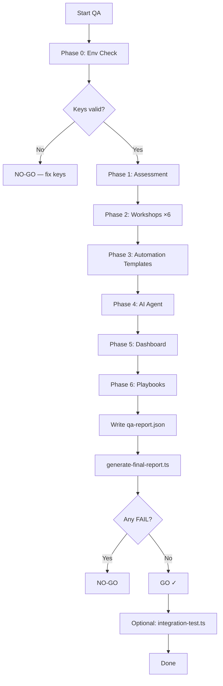

### Understanding GO / NO-GO

| Verdict | Meaning | Action |
|---------|---------|--------|
| **GO** | Zero FAIL results. Warnings are acceptable. | Ready for first client deployment. Review warnings before go-live. |
| **NO-GO** | One or more FAIL results. | Fix failures, re-run QA until GO. |

**Pass / Fail / Warn:**

| Status | Icon | Meaning |
|--------|------|---------|
| PASS | ✓ | Test succeeded |
| FAIL | ✗ | Critical failure — blocks GO |
| WARN | ⚠ | Non-critical issue — review but doesn't block GO |
| SKIP | ○ | Test skipped (missing config) |

**Latest QA result (June 2026):** GO — 98 pass, 0 fail, 8 warn, 92% pass rate.

### Common WARN items (not blockers)

| ID | Warning | What it means |
|----|---------|---------------|
| ENV-03 | Stripe Secret Key not set | Playbook payments won't work until Stripe keys added |
| PB-*-STRIPE | Skipping live checkout | Same — expected without Stripe |
| AT-WIZARD | Interactive-only wizard | QA uses programmatic customization instead |
| Flow 2 | Escalation email not in Resend list | Sandbox blocks non-owner addresses — expected |
| Flow 4 | Stripe webhook not wired locally | Need Stripe CLI for full purchase test |

### Output files

| File | Contents |
|------|----------|
| `qa/results/qa-report.json` | Raw test results (machine-readable) |
| `qa/results/qa-final-report.md` | Human-readable summary with verdict |
| `qa/results/integration-results.json` | Cross-system flow results |

**What success looks like:** Terminal shows `VERDICT: GO` in green. `qa-final-report.md` lists zero failed tests.

> **If something goes wrong:** If phase fails with connection errors, verify all four servers are running on the correct ports. If Claude API calls fail, check `ANTHROPIC_API_KEY` and rate limits.

---

## 9. Cross-System Flows

These five integration flows test how products work together. Each is run by `integration-test.ts`.

### Flow 1: Assessment → Notification → Dashboard

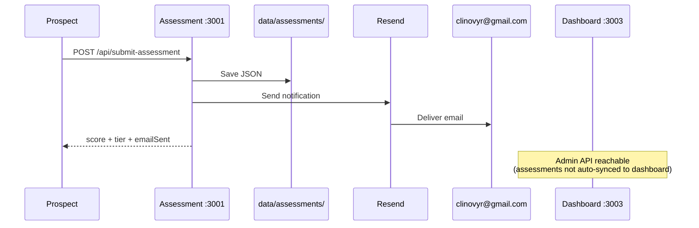

### Flow 2: AI Agent → Escalation → Email

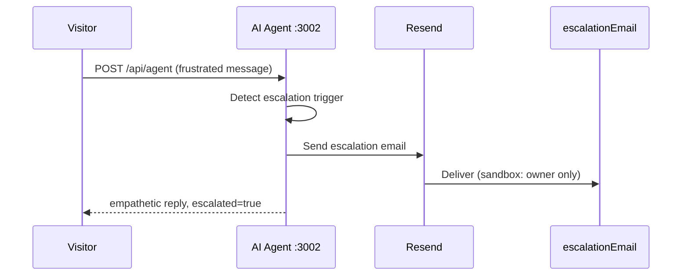

### Flow 3: Dashboard → Monthly Report → Email

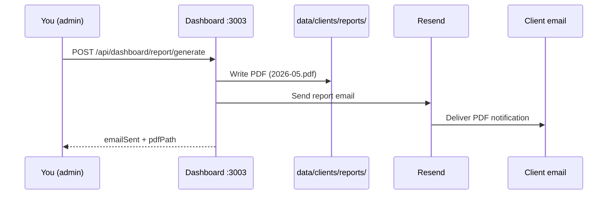

### Flow 4: Playbook → Purchase → PDF Delivery

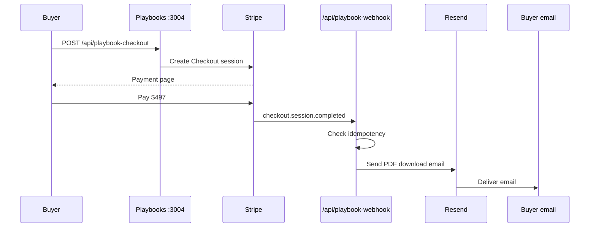

### Flow 5: Workshop Generator → File Delivery

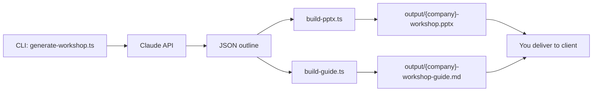

---

## 10. Troubleshooting

### Common errors and fixes

| Error | Likely cause | Fix |
|-------|--------------|-----|
| `EADDRINUSE` | Port already in use | `lsof -i :PORT` then `kill -9 PID` |
| `ANTHROPIC_API_KEY missing` | Key not in env | Add to root `.env.local`, symlink, restart server |
| `RESEND_API_KEY missing` | Key not in env | Same as above |
| Health returns `503` | Missing required env or unwritable `data/` | Check env vars; `chmod` data directories |
| Assessment submit OK but no email | Sandbox mode + wrong recipient | Use `clinovyr@gmail.com`; check `emailSent` in API response |
| Dashboard magic link not received | Resend not configured | Set `RESEND_API_KEY`; check sandbox settings |
| Playbooks health `503` | Missing Stripe keys | WARN only — add Stripe keys for payment testing |
| Agent sessions lost on restart | No Redis | Set up Upstash Redis for production |
| `Module not found` | Dependencies not installed | Run `npm install` in that product folder |
| Workshop dry-run fallback | No API key loaded | Symlink `.env.local` or set key in root file |
| Stripe webhook not firing locally | No Stripe CLI forwarding | `stripe listen --forward-to localhost:3004/api/playbook-webhook` |

### WARN items from QA guide

These are **expected** in local development without full production config:

1. **STRIPE_SECRET_KEY not set** — Playbook checkout skipped. Add test keys when ready to test payments.
2. **Playbooks dev server HTTP 503** — Health reports `error` due to missing Stripe. App still serves pages.
3. **Escalation email not in Resend list** — Sandbox only delivers to account owner.
4. **Assessment not synced to dashboard** — By design. Assessments save locally; dashboard clients are separate.
5. **Wizard interactive-only** — QA uses programmatic template customization.

### Email troubleshooting checklist

1. Is `RESEND_API_KEY` set and starts with `re_`?
2. Is `RESEND_SANDBOX=true`?
3. Is recipient `clinovyr@gmail.com` (the Resend account owner)?
4. Is `RESEND_FROM_EMAIL=Clinovyr <onboarding@resend.dev>`?
5. Check Resend dashboard at [resend.com/emails](https://resend.com/emails) for delivery status.
6. Check API response for `emailSent` and `emailWarning` fields.

### Port reference card

| Service | QA port | health-check.ts port | Production |
|---------|---------|----------------------|------------|
| Assessment | 3001 | 3001 | assessment.clinovyr.com |
| AI Agent | 3002 | 3100 | agent.clinovyr.com |
| Dashboard | 3003 | 3002 | app.clinovyr.com |
| Playbooks | 3004 | 3003 | buy.clinovyr.com |

---

## 11. Production Deployment

All product apps deploy to **Cloudflare Workers** (Next.js via OpenNext) except the AI Agent, which deploys to **Railway** or **Fly.io**.

### Production URLs

| App | URL | Health endpoint |
|-----|-----|-----------------|
| Marketing site | https://clinovyr.com | — |
| Assessment | https://assessment.clinovyr.com | `/api/health` |
| AI Agent | https://agent.clinovyr.com | `/api/health` |
| Dashboard | https://app.clinovyr.com | `/api/health` |
| Playbooks | https://buy.clinovyr.com | `/api/health` |

### Cloudflare Workers (Assessment, Dashboard, Playbooks)

Each Next.js app needs its own Cloudflare Worker:

| Worker name | Root directory | Custom domain |
|-------------|----------------|---------------|
| clinovyr-assessment | `clinovyr-products/assessment` | assessment.clinovyr.com |
| clinovyr-dashboard | `clinovyr-products/dashboard` | app.clinovyr.com |
| clinovyr-playbooks | `clinovyr-products/playbooks` | buy.clinovyr.com |

**Dashboard settings (each Worker):**

| Setting | Value |
|---------|-------|
| Deploy command | `npm run deploy` |
| Node.js version | 22+ |
| Secrets | Set all env vars from `.env.example` |

Each app needs:
- `@opennextjs/cloudflare` and `wrangler` as dev dependencies
- `open-next.config.ts` with `defineCloudflareConfig()`
- `wrangler.jsonc` pointing at `.open-next/worker.js`

**DNS:** Add proxied (orange cloud) CNAME records in Cloudflare for each subdomain pointing to the Worker route.

See `clinovyr-products/DEPLOYMENT.md` and root `DEPLOY.md` for full details.

### AI Agent (Railway or Fly.io)

The AI Agent is **not** Next.js — it cannot run on Cloudflare Workers.

**Railway setup:**

1. Create project → Deploy from GitHub
2. Root directory: `clinovyr-products/ai-agent`
3. Build: `npm run build`
4. Start: `npm start`
5. Custom domain: `agent.clinovyr.com`
6. Set all env vars from `.env.example`
7. Use Upstash Redis for session memory

**Production notes:**
- Set `PORT=3100`
- Set `ESCALATION_QUEUE_PATH` to persistent volume path
- Health check URL: `https://agent.clinovyr.com/api/health`

### Resend domain verification (production email)

Before go-live with real client emails:

1. Log in to [resend.com](https://resend.com)
2. Go to **Domains** → Add `clinovyr.com`
3. Add the DNS records Resend provides (SPF, DKIM) in Cloudflare DNS
4. Wait for verification (usually minutes to hours)
5. Update production env:
   - `RESEND_FROM_EMAIL=Clinovyr <reports@clinovyr.com>` (or similar verified address)
   - `RESEND_SANDBOX=false` (or remove the variable)
6. Test send from each app

Until verified, keep sandbox mode with `onboarding@resend.dev`.

### Stripe setup (production payments)

1. Create Stripe account or switch to live mode at [dashboard.stripe.com](https://dashboard.stripe.com)
2. Get live API keys (`sk_live_...`, `pk_live_...`)
3. Create webhook endpoint: `https://buy.clinovyr.com/api/playbook-webhook`
4. Events to listen for: `checkout.session.completed`
5. Copy webhook signing secret to `STRIPE_WEBHOOK_SECRET`
6. Set all three Stripe env vars in Cloudflare Worker secrets for playbooks

**Test locally first** with `sk_test_...` keys and Stripe CLI.

### Dashboard cron (monthly reports)

Schedule monthly report generation:

```
GET https://app.clinovyr.com/api/cron/monthly-reports
Authorization: Bearer $CRON_SECRET
```

**Schedule:** `0 17 1 * *` (09:00 AM Pacific on the 1st of each month)

Options:
1. Cloudflare Workers Cron Trigger in `wrangler.jsonc`
2. External cron (UptimeRobot, cron-job.org, GitHub Actions)
3. Manual: `npm run cron:monthly-reports` from dashboard directory

### Uptime monitoring

Set up monitors at [uptimerobot.com](https://uptimerobot.com) for each health endpoint:

| Name | URL | Interval |
|------|-----|----------|
| Clinovyr Assessment | https://assessment.clinovyr.com/api/health | 5 min |
| Clinovyr AI Agent | https://agent.clinovyr.com/api/health | 5 min |
| Clinovyr Dashboard | https://app.clinovyr.com/api/health | 5 min |
| Clinovyr Playbooks | https://buy.clinovyr.com/api/health | 5 min |

Optional: keyword monitoring for `"status":"ok"` in response body.

### Verify production deployment

```bash
cd ~/Desktop/Clinoyr/clinovyr-products
npx tsx health-check.ts
```

All four endpoints should return HTTP 200 with `"status":"ok"`.

### Build verification (before deploy)

```bash
cd ~/Desktop/Clinoyr/clinovyr-products/assessment && npm run build
cd ~/Desktop/Clinoyr/clinovyr-products/dashboard && npm run build
cd ~/Desktop/Clinoyr/clinovyr-products/playbooks && npm run build
cd ~/Desktop/Clinoyr/clinovyr-products/ai-agent && npm run build
```

**What success looks like:** All builds complete without errors. Production health check shows 4/4 OK.

---

## 12. Security Checklist

Use this checklist before every deployment and when onboarding a new team member.

### API keys and secrets

- [ ] All secrets in root `.env.local` only — never in product folders (except symlinks)
- [ ] `.env.local` is in `.gitignore` — verify with `git status` (should not appear)
- [ ] No real API keys in this manual, README files, or commit history
- [ ] Production secrets set as Cloudflare Worker secrets or Railway/Fly env vars — not in code
- [ ] `AUTH_SECRET`, `CRON_SECRET` generated with `openssl rand -base64 32`
- [ ] Stripe live keys only in production — test keys (`sk_test_`) for local

### Git and files

- [ ] Never commit `.env.local`, `.env`, `configs/client.json` (HubSpot keys)
- [ ] Client data in `data/` directories is gitignored
- [ ] Generated outputs (`output/`, `customized-for-client/`) are gitignored
- [ ] QA results may contain paths but not secrets

### Application security

- [ ] `ENABLE_TEST_AUTH` is **never** set in production
- [ ] Dashboard cron endpoint protected by `CRON_SECRET` Bearer token
- [ ] Admin routes restricted to `ADMIN_EMAIL`
- [ ] AI Agent rate limiting enabled (via Redis in production)
- [ ] Stripe webhook signature verification enabled (`STRIPE_WEBHOOK_SECRET`)
- [ ] Playbook webhook idempotency prevents duplicate PDF sends

### Data directories

- [ ] `assessment/data/` — writable by app, not publicly accessible
- [ ] `dashboard/data/clients/` — contains client PII; plan for R2/S3 in production
- [ ] `ai-agent/data/escalation-queue.json` — on persistent storage in production
- [ ] Cloudflare Workers have ephemeral filesystem — use R2, S3, or D1 for persistent data in production

### Email

- [ ] Resend sandbox enabled locally (`RESEND_SANDBOX=true`)
- [ ] Production uses verified domain (not `@resend.dev`)
- [ ] `CONTACT_EMAIL=clinovyr@gmail.com` — not deprecated addresses

---

## 13. Glossary

| Term | Simple definition |
|------|-------------------|
| **API (Application Programming Interface)** | A way for software programs to talk to each other. When the assessment form submits, it calls an API endpoint to save data and send email. |
| **API key** | A secret password that proves you're allowed to use a service (Anthropic, Resend, Stripe). Never share or commit to Git. |
| **App Router** | Next.js 15's way of organizing web pages and API routes in the `src/app/` folder. |
| **Bearer token** | A secret string sent in an HTTP header (`Authorization: Bearer xxx`) to authenticate requests, like the dashboard cron endpoint. |
| **Blueprint** | A Make.com automation template file (JSON) that can be imported into a client's Make.com account. |
| **CLI (Command-Line Interface)** | A tool you run in Terminal with text commands (e.g., workshop generator, CRM setup). |
| **Cloudflare Workers** | Cloudflare's serverless platform where Next.js apps run in production. Not the same as traditional web hosting. |
| **Cron** | A scheduled task that runs automatically (e.g., generating monthly reports on the 1st of each month). |
| **DNS (Domain Name System)** | The system that maps domain names (like `clinovyr.com`) to server addresses. You configure DNS in Cloudflare. |
| **Env / .env.local** | Environment variables — configuration settings (especially secrets) stored in a file, not in code. |
| **Escalation** | When the AI agent detects a frustrated visitor and forwards the conversation to a human via email. |
| **Express** | A Node.js web framework used by the AI Agent (not Next.js). |
| **GO / NO-GO** | QA verdict. GO = ready to deploy. NO-GO = critical failures must be fixed first. |
| **Health endpoint** | A URL (`/api/health`) each app exposes to confirm it's running and configured correctly. |
| **HubSpot PAT** | Private App Token — an API key for accessing a client's HubSpot CRM. |
| **Idempotency** | Processing the same event twice without duplicate side effects (e.g., Stripe webhook won't send two PDF emails for one payment). |
| **JSON** | A text format for structured data. Assessment submissions, client configs, and automation templates are all JSON files. |
| **KPI (Key Performance Indicator)** | A measurable number on the dashboard (tasks automated, hours saved, ROI estimate). |
| **Magic link** | A passwordless login method — user enters email, receives a one-time link, clicks to sign in. |
| **Make.com** | A no-code automation platform where clients run workflows (like Zapier). |
| **MRR (Monthly Recurring Revenue)** | The monthly fee a client pays for ongoing services. Shown on the admin dashboard. |
| **n8n** | An open-source automation platform (alternative to Make.com) for self-hosted workflows. |
| **Next.js** | A React-based web framework used for assessment, dashboard, and playbooks apps. |
| **NextAuth / Auth.js** | The authentication library used by the dashboard for magic link login. |
| **OpenNext** | A tool that adapts Next.js apps to run on Cloudflare Workers. |
| **PDF renderer** | Software that converts structured data (JSON) into PDF files (used for assessment reports, playbooks, dashboard reports). |
| **PII (Personally Identifiable Information)** | Data that identifies a person (name, email, phone). Handle client data carefully. |
| **Port** | A numbered "door" on your computer where a server listens (3001, 3002, etc.). |
| **PPTX** | PowerPoint file format. Workshop generator creates these. |
| **Redis** | An in-memory database used by the AI Agent to remember conversation history. Upstash provides cloud Redis. |
| **Resend** | Email delivery service used by all Clinovyr apps. |
| **Sandbox** | A safe testing mode. Resend sandbox only delivers to the account owner's email. |
| **Scoring engine** | The code that calculates AI readiness scores (0–100) from assessment form answers. |
| **Serverless** | Cloud computing where you don't manage a server — Cloudflare Workers are serverless. |
| **Stripe** | Payment processing platform used for playbook purchases. |
| **Symlink** | A file system shortcut. `ln -sf ../../.env.local .env.local` makes the product folder read the root secrets file. |
| **Tier** | Assessment result category: Foundation, Developing, Advanced, or Leader. |
| **TypeScript** | A typed programming language used throughout the Clinovyr codebase. Compiles to JavaScript. |
| **Upstash** | Cloud Redis provider recommended for production AI Agent session memory. |
| **Webhook** | An automatic HTTP callback. When Stripe payment completes, it sends a webhook to the playbooks app to deliver the PDF. |
| **Widget** | An embeddable JavaScript file (`widget.js`) that adds the chat agent to a client's website. |
| **Worker** | A Cloudflare Worker — a serverless function that runs your Next.js app at the edge. |
| **Wrangler** | Cloudflare's CLI tool for deploying Workers. |

---

## 14. Quick Reference Cards

### Card 1: Start everything (QA ports)

```bash
# Terminal 1
cd ~/Desktop/Clinoyr/clinovyr-products/assessment && npm run dev -- -p 3001

# Terminal 2
cd ~/Desktop/Clinoyr/clinovyr-products/ai-agent && PORT=3002 npm run dev

# Terminal 3
cd ~/Desktop/Clinoyr/clinovyr-products/dashboard && npm run dev -- -p 3003

# Terminal 4
cd ~/Desktop/Clinoyr/clinovyr-products/playbooks && npm run dev -- -p 3004
```

### Card 2: Health checks

```bash
curl -s http://localhost:3001/api/health | python3 -m json.tool  # Assessment
curl -s http://localhost:3002/api/health | python3 -m json.tool  # Agent
curl -s http://localhost:3003/api/health | python3 -m json.tool  # Dashboard
curl -s http://localhost:3004/api/health | python3 -m json.tool  # Playbooks

# Production (all at once)
cd ~/Desktop/Clinoyr/clinovyr-products && npx tsx health-check.ts
```

### Card 3: Run full QA

```bash
cd ~/Desktop/Clinoyr/clinovyr-products/qa
ASSESSMENT_URL=http://localhost:3001 AGENT_URL=http://localhost:3002 \
DASHBOARD_URL=http://localhost:3003 STORE_URL=http://localhost:3004 \
ADMIN_EMAIL=clinovyr@gmail.com AUTH_SECRET=playwright-test-secret-min-32-chars-long \
ENABLE_TEST_AUTH=true npx ts-node run-all.ts

npx ts-node generate-final-report.ts
# Read: qa/results/qa-final-report.md
```

### Card 4: Integration tests

```bash
cd ~/Desktop/Clinoyr/clinovyr-products/qa
ASSESSMENT_URL=http://localhost:3001 AGENT_URL=http://localhost:3002 \
DASHBOARD_URL=http://localhost:3003 STORE_URL=http://localhost:3004 \
npx ts-node integration-test.ts
```

### Card 5: Port map

| Service | QA | health-check | Production URL |
|---------|-----|--------------|----------------|
| Assessment | 3001 | 3001 | assessment.clinovyr.com |
| AI Agent | 3002 | 3100 | agent.clinovyr.com |
| Dashboard | 3003 | 3002 | app.clinovyr.com |
| Playbooks | 3004 | 3003 | buy.clinovyr.com |

### Card 6: Key file paths

| What | Path |
|------|------|
| Secrets (local) | `/Clinoyr/.env.local` |
| Assessment submissions | `assessment/data/assessments/*.json` |
| Assessment PDFs | `assessment/data/reports/*.pdf` |
| Agent client configs | `ai-agent/config/clients/*.json` |
| Dashboard client data | `dashboard/data/clients/{id}/` |
| Playbook JSON | `playbooks/content/playbooks/{slug}/v1.json` |
| Playbook PDFs | `playbooks/output/pdfs/{slug}-v1.pdf` |
| Workshop output | `workshop-generator/output/` |
| Make.com templates | `automation-templates/make/templates/` |
| n8n workflows | `automation-templates/n8n/*.workflow.json` |
| QA report | `qa/results/qa-final-report.md` |

### Card 7: Important email settings

| Setting | Local value | Production value |
|---------|-------------|-------------------|
| `CONTACT_EMAIL` | clinovyr@gmail.com | clinovyr@gmail.com |
| `RESEND_FROM_EMAIL` | Clinovyr \<onboarding@resend.dev\> | Clinovyr \<reports@clinovyr.com\> |
| `RESEND_SANDBOX` | true | false |
| `ADMIN_EMAIL` | clinovyr@gmail.com | your admin email |

### Card 8: Generate secrets

```bash
openssl rand -base64 32   # Run 3x for AUTH_SECRET, NEXTAUTH_SECRET, CRON_SECRET
```

### Card 9: Common npm commands by product

| Product | Command | Purpose |
|---------|---------|---------|
| assessment | `npm run dev -- -p 3001` | Start dev server |
| assessment | `npm test` | Jest unit tests |
| ai-agent | `PORT=3002 npm run dev` | Start dev server |
| dashboard | `npm run dev -- -p 3003` | Start dev server |
| dashboard | `npx ts-node scripts/seed-test-data.ts` | Seed test clients |
| playbooks | `npm run dev -- -p 3004` | Start dev server |
| playbooks | `npm run generate:all -- --version 1` | Generate all playbooks |
| playbooks | `npm run build-pdf:all -- --version 1` | Build all PDFs |
| workshop-generator | `npm run generate -- --industry "Medical" --company "..." --audience "..."` | Generate workshop |
| automation-templates/make | `npm run wizard` | Customize templates |
| qa | `npx ts-node run-all.ts` | Full QA suite |
| qa | `npx ts-node integration-test.ts` | Cross-system tests |

---

*End of Clinovyr Operations Manual. For production deployment details, see also `clinovyr-products/DEPLOYMENT.md` and root `DEPLOY.md`.*
